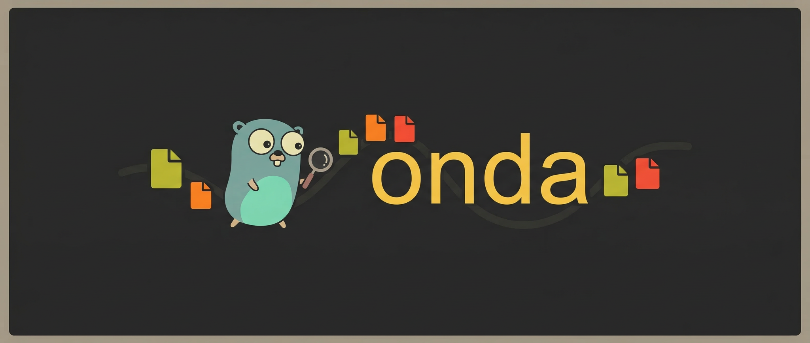

onda is a tiny, "hardware-accelerated" file sniffer for Go.

## Blazing Fast

onda achieves sub-millisecond detection times through extreme mechanical sympathy. Instead of allocating memory, iterating slices, or using locks at runtime, onda uses a custom Ahead-of-Time (AOT) compiler to generate a deeply nested Radix Trie (Prefix Tree) in pure Go.

The Go compiler flattens this tree into a highly optimized jump table in assembly. The CPU branch predictor routes file signatures in nanoseconds-resulting in **zero-allocation startup**, **zero runtime locks**, and $O(1)$ time complexity for 95% of files.

```bash
$ time onda onda
onda
  ⮡ Executable and Linkable Format
    Type: ELF64 Little-Endian

real	0m0.002s
user	0m0.000s
sys 	0m0.002s
```
*(Benchmark ran on an AMD Ryzen 7 7840U / CachyOS Linux)*

## Features

- **Hardware-Accelerated Hot Path**: $O(1)$ magic-byte detection via AOT-compiled jump tables.
- **Zero-Cost Abstraction**: Static signatures are stripped from the runtime binary, saving memory and `init()` overhead.
- **Smart Fallbacks**: Includes custom structural parsers for complex formats (SVG, ZIP, XML, Text) that lack fixed headers.
- **Versatile**: Works as both a standalone CLI and a lightweight Go package.

## Installation

Prebuilt releases are available [here](https://github.com/coalaura/onda/releases) or install it via Go:

```bash
go install github.com/coalaura/onda@latest
```

## Usage

```bash
onda <file>
```

Example:

```bash
onda sample.png
```

## Go package

```go
package main

import (
	"fmt"

	"github.com/coalaura/onda/types"
	_ "github.com/coalaura/onda/types/all"
)

func main() {
	meta, err := types.Detect("sample.png", []byte{0x89, 'P', 'N', 'G', 0x0d, 0x0a, 0x1a, 0x0a})
	if err != nil {
		fmt.Println("unknown")
		return
	}

	fmt.Println(meta.Kind.String(), meta.Type.String())
}
```

## Supported types

#### Archive/package/filesystem:
7-Zip archive, APFS filesystem, AR archive, Android app bundle (AAB), Android archive (AAR), Android package (APK), Android split APK set (APKS), Android package (XAPK), Android system package (APEX), APPX package, AppleDouble file, AppleSingle file, Btrfs filesystem, Bzip2 archive, Cabinet archive, Conda package (tar), CPIO archive (new ASCII, new ASCII with CRC, old ASCII, binary big-endian, binary little-endian), CramFS, Debian package, exFAT filesystem, ext filesystem (ext2, ext3, ext4), Firefox extension (XPI), Git index, Git pack, Gzip archive, HFS+ filesystem, iOS application archive (IPA), Java archive (JAR), Java enterprise archive (EAR), Java web archive (WAR), KMZ archive, LHA archive, LUKS disk encryption, LZ4 frame, LZFSE data, LZIP archive, LZOP archive, MacBinary, MSIX package, NuGet package (NUPKG), npm package tarball, NTFS filesystem, OCI image layout (tar), Python source distribution (sdist), Python wheel (WHL), RAR archive (RAR4, RAR5), ROMFS, RPM package, RubyGem package, Sketch document, Snappy framed data, SquashFS filesystem, StuffIt archive, TAR archive, Unix compress archive, Visual Studio extension (VSIX), WAD archive (IWAD, PWAD), Windows Imaging Format, XAR archive, XFS filesystem, XZ archive, ZIP archive (standard, empty, spanned), ZPAQ archive, Zstandard archive, Zstandard dictionary.

#### Audio/tracker:
AAC audio (ADTS), AC-3, E-AC-3, AIFF audio (AIFF, AIFC), AMR audio, AMR-WB audio, AU audio, CAF audio, CD audio (CDA), DSDIFF audio, DSF audio, DTS audio, FLAC audio, Impulse Tracker module, FastTracker module, MIDI sequence, Monkey's Audio, MP3 audio (ID3 tagged, MPEG audio frame), MPEG Layer II, MPEG Layer III, Musepack audio (stream version 7, stream version 8), Ogg container, OptimFROG audio, Opus audio, QCP audio, RKAudio, Scream Tracker module, Speex audio, TAK audio, TTA audio, VOC audio, Vorbis audio, WAV audio, WavPack audio, MPEG-4 audio (M4A family).

#### Image/texture/icon:
ASTC texture, AVIF image (single image, sequence), BMP image, BPG image, Canon RAW image (CR2, CR3), Cineon image, DDS image, DjVu document, DPX image (little-endian, big-endian), Enhanced Metafile image (EMF), Farbfeld image, Fujifilm RAW image (RAF), GIF image (GIF87a, GIF89a), GIMP XCF image, glTF binary (GLB), HEIF image, ICNS icon, ICC profile, JPEG image, JPEG 2000 image (codestream), JPEG XL image (codestream, container), JNG image, JPEG XR image (little-endian, big-endian), KTX texture (KTX, KTX2), MNG image, Netpbm image (PBM ASCII, PGM ASCII, PPM ASCII, PBM binary, PGM binary, PPM binary, PAM), Nikon RAW image (NEF), Olympus RAW image (ORF), OpenEXR image, OpenRaster image (ORA), Panasonic RAW image (RW2), Pentax RAW image (PEF), PCX image, PNG image, Photoshop document (PSD, PSB), PVR texture, QOI image, Radiance HDR image, SGI image, Sony RAW image (ARW/SR2), Sun raster image, SVG image, TIFF image (little-endian, big-endian), Adobe DNG image, WebP image, Windows Metafile image (WMF), Windows icon, Windows cursor, XPM image.

#### Video/container:
3GPP media, 3G2 media, ASF container, AVI video, Bink video, EBML container, FLV video, F4V video, IVF video, ISO Base Media file, M3U8 playlist, M4V video, Matroska container, MP4 video, MPEG program stream, MPEG transport stream (TS, M2TS, M2TS/BDAV), MPEG video (MPEG-1/2), QuickTime movie, RealMedia, RIFF container, Smacker video, Theora video, WebM container, WTV video.

#### Document/data/database/model:
3MF document, Adobe InDesign document, Apache Arrow file, Apache Parquet, Apple binary property list, Apple Desktop Services Store (DS_Store), Apple iWork document, AutoCAD drawing, Avro object container, BAM data, CBOR data, CorelDRAW document (CDR), CRAM data, DICOM medical image, EPUB document, ESRI Shapefile, FBX model, FITS astronomical image, GRIB data, HDF5 data, HTML document, iCalendar (ICS), KeePass database (KDBX), Maya ASCII, Maya Binary, Microsoft Access database, Microsoft Excel workbook (XLS), Microsoft Excel spreadsheet (XLSX), Microsoft Excel macro-enabled workbook/template/add-in (XLSM, XLTM, XLAM), Microsoft Installer (MSI), Microsoft Outlook email folder (PST/OST), Microsoft Outlook message (MSG), Microsoft PowerPoint presentation (PPT, PPTX), Microsoft PowerPoint macro-enabled presentation/template/slideshow/add-in (PPTM, POTM, PPSM, PPAM), Microsoft Word document (DOC, DOCX), Microsoft Word template/macro-enabled variants (DOTX, DOCM, DOTM), MOBI document, NetCDF data, OLE compound document, OpenDocument presentation (ODP), OpenDocument spreadsheet (ODS), OpenDocument text (ODT), ORC columnar data, PDF document, PEM certificate, PEM private key, PGP message, PLY model, PostgreSQL custom dump, PostScript document, Redis database, Rich Text Format document, SketchUp model, SQLite database, Timezone data, Torrent file, U3D model, vCard (VCF), WARC file, WebVTT, Windows registry hive, XML document.

#### Font:
EOT font, OpenType font, TrueType font, TrueType collection, WOFF font, WOFF2 font.

#### Executable/system/disk/game:
Android ART, Android boot image, Android oat, Android odex, Android sparse image, Android VDEX, AppImage, Blender file, CRX browser extension (v2/v3), Dalvik executable (DEX 035, DEX 036, DEX 037, DEX 038, DEX 039, DEX 040, DEX 041), Executable and Linkable Format (ELF/ELF32/ELF64, little-endian/big-endian), Game Boy ROM, Game Boy Advance ROM, GameCube ROM, ISO 9660 image, Java class, Java KeyStore, Java module (JMOD), LLVM bitcode (raw, wrapper), Lua bytecode, Mach-O binary (32-bit/64-bit, little-endian/big-endian), Mach-O universal binary (32-bit, 64-bit), NES ROM, Nintendo 3DS ROM, Nintendo 64 ROM, Nintendo DS ROM, Nintendo Switch Package, Nintendo Switch ROM, PCAP capture (little-endian, big-endian, nanosecond little-endian, nanosecond big-endian), PCAPNG capture, PKCS#12, PlayStation Portable ISO, Portable Executable (PE32/PE32+), Python bytecode, QCOW disk image (QCOW2), Sega Mega Drive ROM, Shebang script, Shockwave Flash (uncompressed, zlib compressed, lzma compressed), Symbian Installation Format, U-Boot image, VHD disk image, VirtualBox disk image, VHDX disk image, VMware disk image (VMDK), WebAssembly module, Wii Backup File System, Wii ROM, Windows event log (EVTX), Windows shortcut, Xbox ISO, ZX Spectrum Tape.

#### Text fallback:
ASCII text, UTF-8 text.
